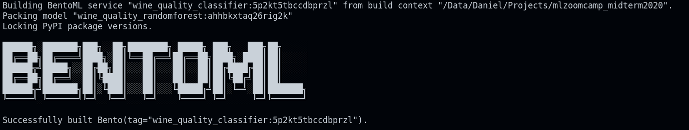
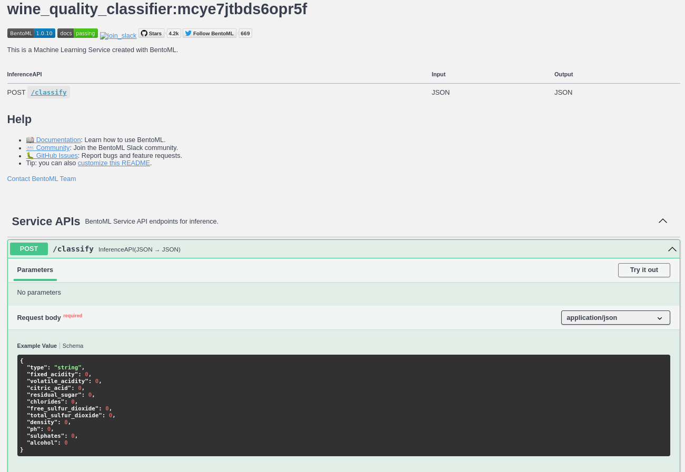

# ML-ZOOMCAMP MIDTERM PROJECT 

This is a Midterm project for ML Zoomcamp 2022 

In this repo we will be working with the [**Wine quality dataset **](https://archive.ics.uci.edu/ml/datasets/wine+quality) dataset from UCI center for Machine Learning. 

The goal of this project is to classify the wine quality based on some of their physical and chemical properties. 


# Data Description 

The following table provides an overview of the dataset. The available fields and what they were used for, as well as the type of data.  

|Field|Use|Dtype|
|------|------------|-----|
type|Feature| str 
fixed_acidity|Feature|float 
volatile_acidity|Feature|float 
citric_acid|Feature|float 
residual_sugar|Feature|float 
chlorides|Feature|float 
free_sulfur_dioxide|Feature|float 
total_sulfur_dioxide|Feature|float 
density|Feature|float 
ph|Feature|float 
sulphates|Feature|float 
alcohol|Feature|float 
**Quality**|**Target**|**int** 

## Data Preparation 

- Missing data: The missing values were filled using the median values of each wine type (red or white).
    |Type|fixed_acidity|volatile_acidity|citric_acid|residual_sugar|chlorides|ph|sulphates|	
    |----|-------------|----------------|-----------|--------------|---------|--|---------|
    |white|	6.856|	0.278|0.334|6.393|0.046|3.188|0.490|
    |red|8.322|  0.528|0.271|2.539|0.087|3.311|0.658|

- Quality_encoding: Since the objective is classify the quality of the wine, the scores from 0-10 were binned into bad,moderate and good quality wine. Given that *good* > *moderate* > *bad*, we can use ordinal encoding.

    |Quality| Score range| code |
    |-------|------------|----- |
    |Bad    | < 5        | 0    |
    |Moderate |5-6       | 1    |
    |Good   | > 7        | 2    |

- Type Encoding: The type of wine was enconded as red &rarr; 0 and white &rarr; 1

# ML modeling 

The models tested were: `LogisticRegression`, `DecisionTreeClassifier`, `RandomForestClassifier` and `XGBClassifier`

## Validation framework

The dataset was splitted as train/test with prpportions of 0.8 and 0.2 respectively . Given that the dataset is imbalanced, the dataset split was done in an *stratified* fashion using the *quality* labels.

The train dataset was split in 2 using a 0.25 fraction of it as validation (0.2 fraction of the full dataset)

## Pipeline 

Before using `Pipeline`,the datasets are first converted to vectors using `DictVectorizer`.

The `Pipeline` object contains to steps:

1. Preprocessing: Given the long-tailed distributions of some of the features `RobustScaler` was applied to the feature vectors.
2. Classifier: Model that is used and evaluated

## Evaluation 

The model evaluation was performed in using different metrics. 
- Area under the RO curve.
- F1 multiclass score:
    - F1 macro 
    - F1 weighted 
 
Additionally, the inspection of the confussion matrix and recall to understand the weaknesses and virtues of the model. 

##  Select Best Model 

Recall for the best models are as follows: 
                         
| Model    	| Bad 	| Moderate 	| Good 	|
|----------	|-----	|----------	|------	|
| RT_best  	| 16  	| 91       	| 63   	|
| xgb_best 	| 16  	| 94       	| 56   	|
| RT_base  	| 14  	| 97       	| 50   	|
| xgb_base 	| 14  	| 93       	| 55   	|

We can see that while the metrics are quite similar, some models perform better or worst in some of the categories. In general, we get good predictions for moderate-quality wines. However, Some models are better at predicting either the bad- or good-quality wines. 

If we compare the best RandomForest (RT_best) with the best XGB (xgb_best), we can observe that both models have the same low recall for bad-quality wines. RT_best perform better at predicting good-quality while xgb_best is better at predicting moderate quality wines. 

If we assume that we care more about prediciting correctly the good quality wine, then we select as the best model `RT_best` and its metrics are as follows:
- Weighted ACU 0.857
- Macro avg F1-score 0.58
- Weighted avg F1-score 0.82


# How to use this project

First things first. Clone this repository and create a virtual environment. 

```bash 
git clone https://github.com/drcoronel/mlzoomcamp_midterm2020.git && cd mlzoomcap_midterm2020 
pip install pipenv 
pipenv shell 
```

Now, you'll have all the dependencies installed in a virtual environment for this project. 

There are a few thing that you can try out: 
- You can deploy the service using the `bentoml` model stored in `model` folder. 
- You can train a new model and save it using `bentoml` and `train.py` 

## Using the existing model 

```bash
bentoml models import model/wine_quality_randomforest-ahhbkxtaq26rig2k.bentomodel
bentoml serve service.py:svc
```
The existing model 

```yaml
name: t file, requirements.txt or pwine_quality_randomforest                                                                                                                               
version: ahhbkxtaq26rig2k                                                                                                                                     
module: bentoml.sklearn                                                                                                                                       
labels: {}                                                                                                                                                    
options: {}                                                                                                                                                   
metadata:                                                                                                                                                     
  auc: 0.857                                                                                                                                                  
  f1_macro: 0.58                                                                                                                                              
  f1_weighted: 0.82                                                                                                                                           
context:                                                                                                                                                      
  framework_name: sklearn                                                                                                                                     
  framework_versions:                                                                                                                                         
    scikit-learn: 1.1.3                                                                                                                                       
  bentoml_version: 1.0.10                                                                                                                                     
  python_version: 3.8.10                                                                                                                                      
signatures:                                                                                                                                                   
  predict:                                                                                                                       
    batchable: true                                                                                                                                           
    batch_dim:                                                                                                                                                
    - 0                                                                                                                                                       
    - 0                                                                                                                                                       
  predict_proba:                                                                                                                                              
    batchable: true                                                                                                                                           
    batch_dim:                                                                                                                                                
    - 0                                                                                                                                                       
    - 0                                                                                                                                                       
api_version: v1                                                                                                                                               
creation_time: '2022-11-09T23:26:59.052366+00:00'  
```


## Make your own model  

You can change the model or the hyperparameters used during training using `train.py`.

```bash
python train.py
```
After running, in the terminal you'll see the new models tag. Just go and replace it in `service.py` :p 


# Deployment using BentoML

```bash 
bentoml build 
```



Now, we can build a docker image using the following snippet

```bash
bentoml containerize wine_quality_classifier:mcye7jtbds6opr5f
```

And we are ready to deploy our server :) 
```bash
docker run -it --rm -p 3000:3000 wine_quality_classifier:mcye7jtbds6opr5f serve --production
```

Now that the server is deployed, you can go to [http://0.0.0.0:3000](http://0.0.0.0:3000) and use the API :) 




Try it: 

```json
{"type": "white",
 "fixed_acidity": 8.8,
 "volatile_acidity": 0.23,
 "citric_acid": 0.35,
 "residual_sugar": 10.7,
 "chlorides": 0.04,
 "free_sulfur_dioxide": 26.0,
 "total_sulfur_dioxide": 183.0,
 "density": 0.9984,
 "ph": 2.93,
 "sulphates": 0.49,
 "alcohol": 9.1} 

{"type": "red",
 "fixed_acidity": 6.9,
 "volatile_acidity": 0.52,
 "citric_acid": 0.25,
 "residual_sugar": 2.6,
 "chlorides": 0.081,
 "free_sulfur_dioxide": 10.0,
 "total_sulfur_dioxide": 37.0,
 "density": 0.99685,
 "ph": 3.46,
 "sulphates": 0.5,
 "alcohol": 11.0}
```

You can also use `curl` to send a request to the server:

```bash 
curl -X 'POST' \
  'http://localhost:3000/classify' \
  -H 'accept: application/json' \
  -H 'Content-Type: application/json' \
  -d '{"type": "white",
 "fixed_acidity": 8.8,
 "volatile_acidity": 0.23,
 "citric_acid": 0.35,
 "residual_sugar": 10.7,
 "chlorides": 0.04,
 "free_sulfur_dioxide": 26.0,
 "total_sulfur_dioxide": 183.0,
 "density": 0.9984,
 "ph": 2.93,
 "sulphates": 0.49,
 "alcohol": 9.1} '
```

The response for the first example looks like this:

```json
{
  "Probabilities": {
    "bad": 0.09,
    "moderate": 0.77,
    "good": 0.14
  },
  "Quality": "moderate"
}
```

# Cloud Deployment 

The model was deployed using AWS Elastic Container Services 

First, make sure that `aws-cli` is installed.

```bash
curl "https://awscli.amazonaws.com/awscli-exe-linux-x86_64.zip" -o "awscliv2.zip"
unzip awscliv2.zip
sudo ./aws/install
ln -s /usr/bin/aws aws
```

1. We need to create a Elastic Container Regestry and push the docker image to it. 

  ```bash
  aws ecr get-login-password --region {region} | docker login --username AWS --password-stdin {registry_url}

  docker tag {docker_image_tag} {registry_url}/wine_quality_classifier:latest

  docker push {registry_url}/wine_quality_classifier:latest
  ```

2. We create a cluster in EC service. In this case I used an AWS Fargate Linux cluster.

3. We create a task and assigned the URI from the docker image that we pushed to the registry.

4. We run the task 

5. Test 

Now the service is deployed in the cloud and the API is exposed

https://user-images.githubusercontent.com/19703830/201196177-c328b026-ea9f-4765-aaa9-dba15d4ded84.mp4


Additonally, we could also send a request using curl

https://user-images.githubusercontent.com/19703830/201196206-d38a733f-cf12-4803-9994-3c6a142e8c3d.mp4


# Reference
P. Cortez, A. Cerdeira, F. Almeida, T. Matos and J. Reis.
Modeling wine preferences by data mining from physicochemical properties. In Decision Support Systems, Elsevier, 47(4):547-553, 2009.
